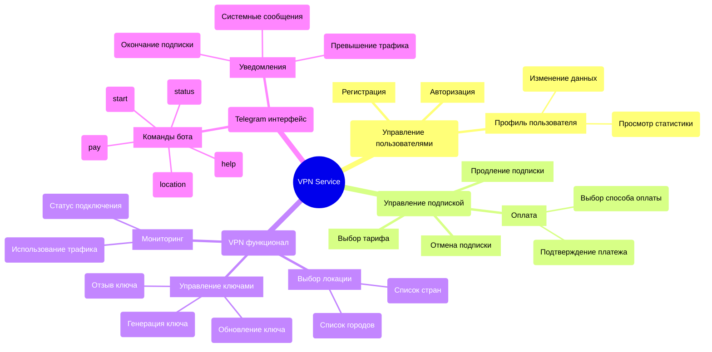
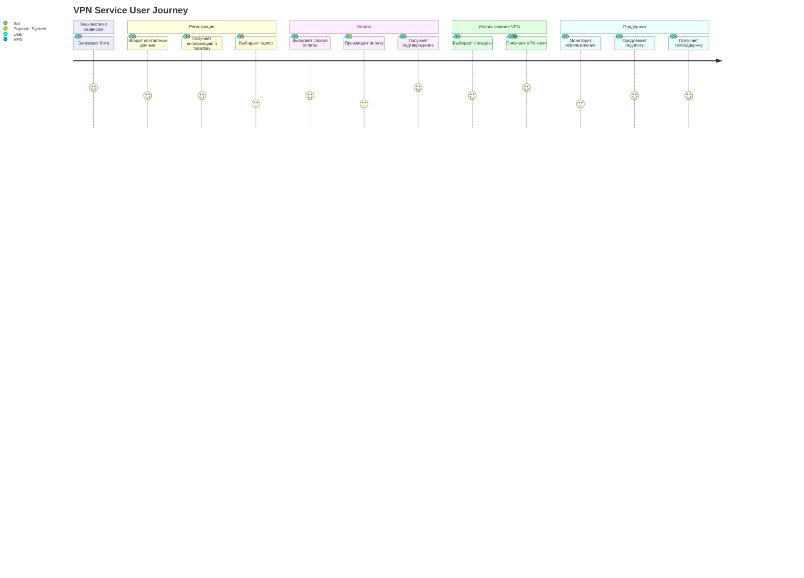
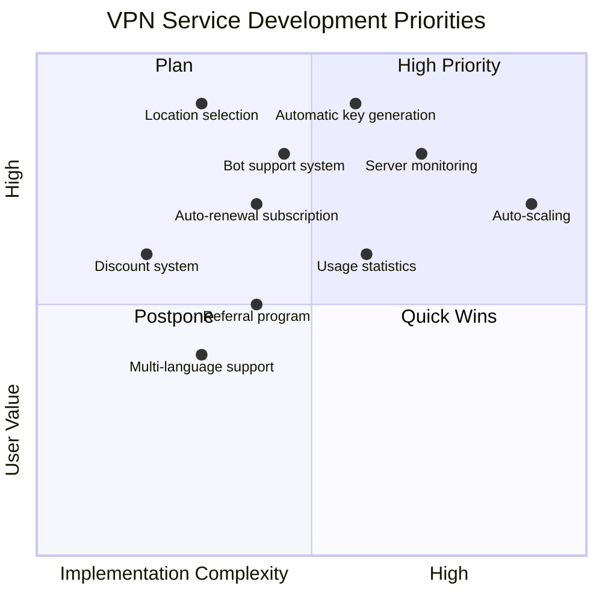
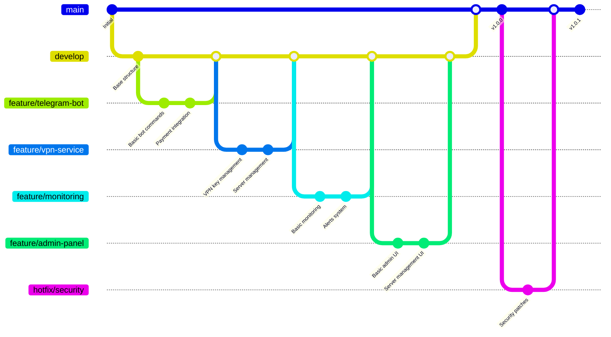

```mermaid
mindmap
  root((VPN Service))
    (Управление пользователями)
      [Регистрация]
      [Авторизация]
      [Профиль пользователя]
        (Изменение данных)
        (Просмотр статистики)
    (Управление подпиской)
      [Выбор тарифа]
      [Оплата]
        (Выбор способа оплаты)
        (Подтверждение платежа)
      [Продление подписки]
      [Отмена подписки]
    (VPN функционал)
      [Выбор локации]
        (Список стран)
        (Список городов)
      [Управление ключами]
        (Генерация ключа)
        (Отзыв ключа)
        (Обновление ключа)
      [Мониторинг]
        (Статус подключения)
        (Использование трафика)
    (Telegram интерфейс)
      [Команды бота]
        (start)
        (help)
        (status)
        (location)
        (pay)
      [Уведомления]
        (Окончание подписки)
        (Превышение трафика)
        (Системные сообщения)
```

```mermaid
journey
    title VPN Service User Journey
    section Знакомство с сервисом
      Запускает бота: 5: User, Bot
    section Регистрация
      Вводит контактные данные: 4: User, Bot
      Получает информацию о тарифах: 4: User, Bot
      Выбирает тариф: 3: User, Bot
    section Оплата
      Выбирает способ оплаты: 4: User, Bot
      Производит оплату: 3: User, Payment System
      Получает подтверждение: 5: User, Bot
    section Использование VPN
      Выбирает локацию: 4: User, Bot
      Получает VPN ключ: 5: User, Bot, VPN
    section Поддержка
      Мониторит использование: 3: User, Bot
      Продлевает подписку: 4: User, Bot
      Получает техподдержку: 4: User, Bot
```

```mermaid
quadrantChart
    title VPN Service Development Priorities
    x-axis Implementation Complexity --> High
    y-axis User Value --> High
    quadrant-1 High Priority
    quadrant-2 Plan
    quadrant-3 Postpone
    quadrant-4 Quick Wins
    Automatic key generation: [0.58, 0.9]
    Multi-language support: [0.3, 0.4]
    Discount system: [0.2, 0.6]
    Server monitoring: [0.7, 0.8]
    Auto-scaling: [0.9, 0.7]
    Referral program: [0.4, 0.5]
    Bot support system: [0.45, 0.8]
    Location selection: [0.3, 0.9]
    Usage statistics: [0.6, 0.6]
    Auto-renewal subscription: [0.4, 0.7]
```

```mermaid
gitGraph
    commit id: "Initial"
    branch develop
    checkout develop
    commit id: "Base structure"
    branch feature/telegram-bot
    commit id: "Basic bot commands"
    commit id: "Payment integration"
    checkout develop
    merge feature/telegram-bot
    branch feature/vpn-service
    commit id: "VPN key management"
    commit id: "Server management"
    checkout develop
    merge feature/vpn-service
    branch feature/monitoring
    commit id: "Basic monitoring"
    commit id: "Alerts system"
    checkout develop
    merge feature/monitoring
    branch feature/admin-panel
    commit id: "Basic admin UI"
    commit id: "Server management UI"
    checkout develop
    merge feature/admin-panel
    checkout main
    merge develop
    commit id: "v1.0.0"
    branch hotfix/security
    commit id: "Security patches"
    checkout main
    merge hotfix/security
    commit id: "v1.0.1"
```